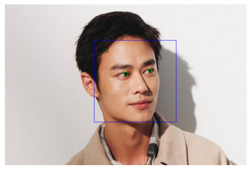

# 嵌入式影像處理作業一:人臉瞳孔偵測
載入人臉模型
偵測臉 → 偵測眼睛
在眼睛內找「黑色區域」＝瞳孔
import cv2
import numpy as np
from matplotlib import pyplot as plt

# 讀取圖片
# img_path = list(uploaded.keys())[0] # Original line
img = cv2.imread("face.jpg") # Modified to directly load the available file
gray = cv2.cvtColor(img, cv2.COLOR_BGR2GRAY)

# 載入模型
face_cascade = cv2.CascadeClassifier(cv2.data.haarcascades + 'haarcascade_frontalface_default.xml')
eye_cascade = cv2.CascadeClassifier(cv2.data.haarcascades + 'haarcascade_eye.xml')

# 偵測人臉
faces = face_cascade.detectMultiScale(gray, 1.3, 5)

for (x, y, w, h) in faces:
    cv2.rectangle(img, (x,y), (x+w,y+h), (255,0,0), 2)
    roi_gray = gray[y:y+h, x:x+w]
    roi_color = img[y:y+h, x:x+w]

    # 偵測眼睛
    eyes = eye_cascade.detectMultiScale(roi_gray)

    for (ex, ey, ew, eh) in eyes:
        eye_gray = roi_gray[ey:ey+eh, ex:ex+ew]
        eye_color = roi_color[ey:ey+eh, ex:ex+ew]

        # 模糊 + 二值化
        blur = cv2.GaussianBlur(eye_gray, (7,7), 0)
        _, thresh = cv2.threshold(blur, 30, 255, cv2.THRESH_BINARY_INV)

        # 找輪廓
        contours, _ = cv2.findContours(thresh, cv2.RETR_TREE, cv2.CHAIN_APPROX_SIMPLE)

        for cnt in contours:
            area = cv2.contourArea(cnt)
            if area > 50:
                (cx, cy), radius = cv2.minEnclosingCircle(cnt)
                center = (int(cx), int(cy))
                radius = int(radius)

                cv2.circle(eye_color, center, radius, (0,255,0), 2)
                break

# 顯示圖片
img_rgb = cv2.cvtColor(img, cv2.COLOR_BGR2RGB)
plt.imshow(img_rgb)
plt.axis('off')

